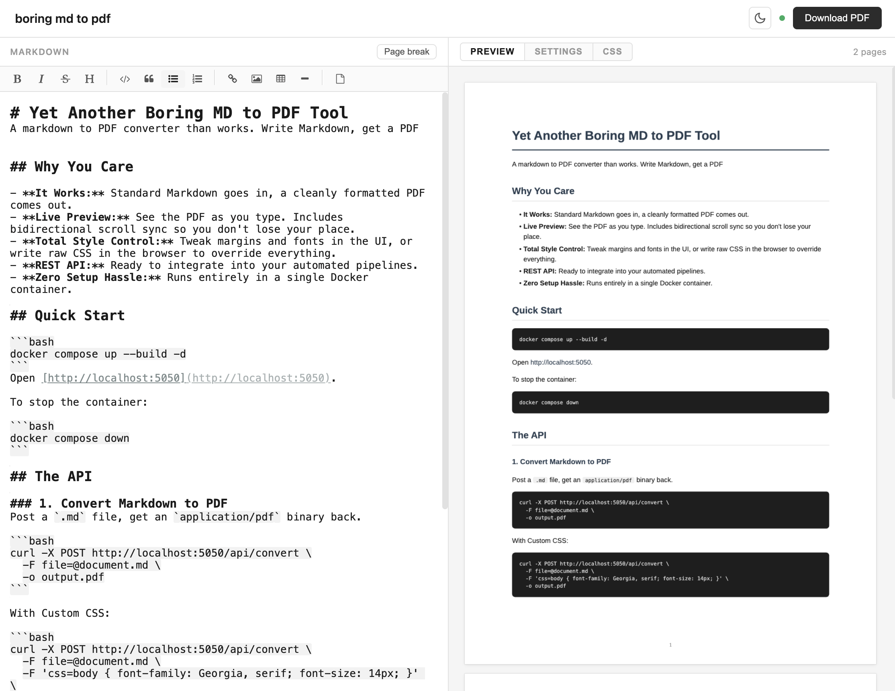

# Yet Another Boring MD to PDF Tool
A markdown to PDF converter than works. Write Markdown, get a PDF

[](https://www.python.org/)
[](https://www.docker.com/)
[](LICENSE)



## Features

- **It Works:** Standard Markdown goes in, a cleanly formatted PDF comes out.
- **Live Preview:** See the PDF as you type. Includes bidirectional scroll sync so you don't lose your place.
- **Total Style Control:** Tweak margins and fonts in the UI, or write raw CSS in the browser to override everything.
- **REST API:** Ready to integrate into your automated pipelines.
- **Zero Setup Hassle:** Runs entirely in a single Docker container.

## Quick Start

```bash
docker run -d -p 5050:5050 --name boring-md-pdf ghcr.io/psalias2006/boring-md-pdf:latest
```
Open [http://localhost:5050](http://localhost:5050).


## The API

### 1. Convert Markdown to PDF
Post a `.md` file, get an `application/pdf` binary back.

```bash
curl -X POST http://localhost:5050/api/convert \
  -F file=@document.md \
  -o output.pdf
```

With Custom CSS:

```bash
curl -X POST http://localhost:5050/api/convert \
  -F file=@document.md \
  -F 'css=body { font-family: Georgia, serif; font-size: 14px; }' \
  -o output.pdf
```

### 2. Get Default CSS
Grab the baseline stylesheet to start customizing.

```bash
curl http://localhost:5050/api/default-css
```

## Formatting & Styles

- **Page Breaks:** Use the editor's toolbar button, or type `<div class="page-break"></div>` directly in your Markdown.
- **Styling Priority:** The web UI offers Settings for quick visual tweaks and CSS for raw code. Editing the raw CSS overrides the visual settings until you hit the reset button.

## Under the Hood

A simple Flask backend running `markdown2` and `WeasyPrint`, with a frontend powered by EasyMDE and PDF.js.